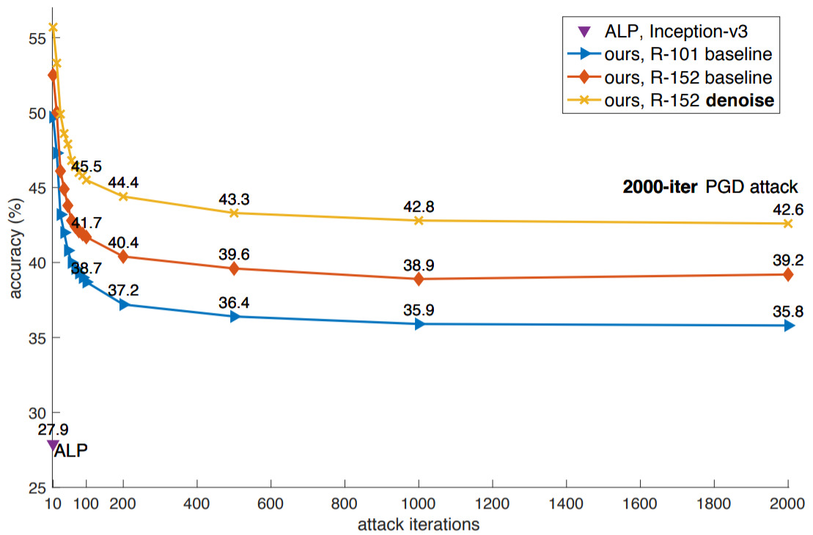

# Feature Denoising for Improving Adversarial Robustness

Code and models for the paper [Feature Denoising for Improving Adversarial Robustness](https://arxiv.org/abs/1812.03411).

## Introduction

  

By combining large-scale adversarial training and feature-denoising layers,
we developed ImageNet classifiers with strong adversarial robustness.

Trained on __128 GPUs__, our ImageNet classifier has 42.6% accuracy against an extremely strong
__2000-steps__ white-box PGD attacker. 
This is a scenario where no previous models have achieved more than 1% accuracy.

On black-box adversarial defense, our method won the __champion of defense track__ in the
[CAAD (Competition of Adversarial Attacks and Defenses) 2018](https://en.caad.geekpwn.org).
It also greatly outperform the CAAD 2017 defense track winner when evaluated
against CAAD 2017 black-box attackers.

This repo contains:

1. Our pre-trained models together with the evaluation script to verify their robustness.
   We welcome attackers to attack our models and defensers to compare with our models.

2. Our distributed adversarial training code on ImageNet.

Please see [INSTRUCTIONS.md](INSTRUCTIONS.md) for the usage.

## License

## Citation
